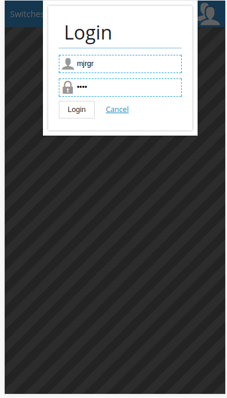
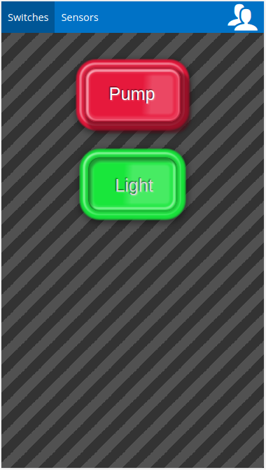
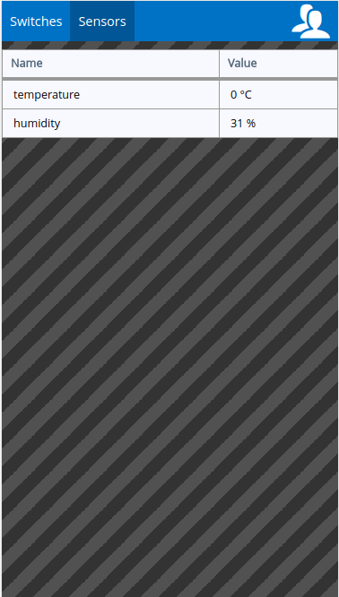

# rPi Pool Project

raspberry Pi Kotlin project  

## Build
use **docker/build.sh** script to build project images

## Screens

##### Login screen


##### Switches screen


##### Sensors screen


   
## References
* https://github.com/skiwithpete/relaypi
* https://github.com/marcandreuf/sunfounder-sensors-raspi-4j

## Examples using Pi4J

```java
    final GpioController gpio = GpioFactory.getInstance();
    Pin pin = RaspiPin.getPinByName("GPIO " + number);
```